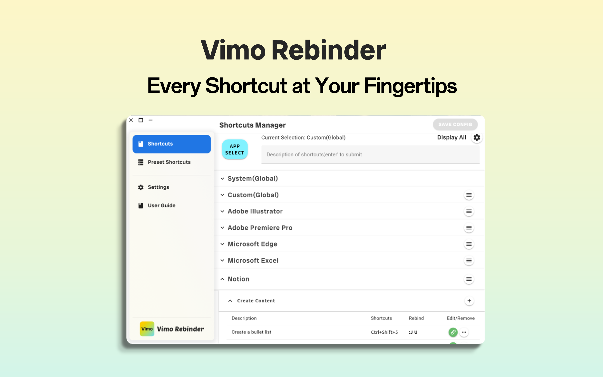
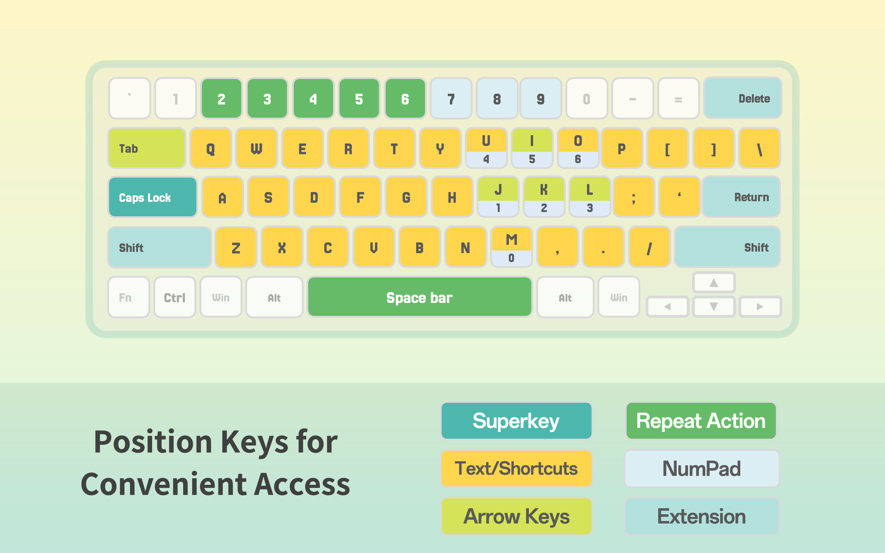
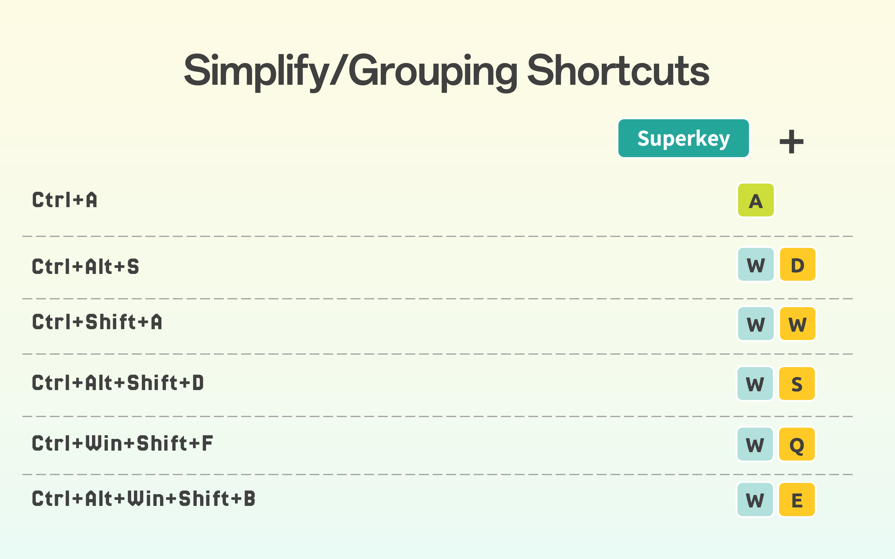
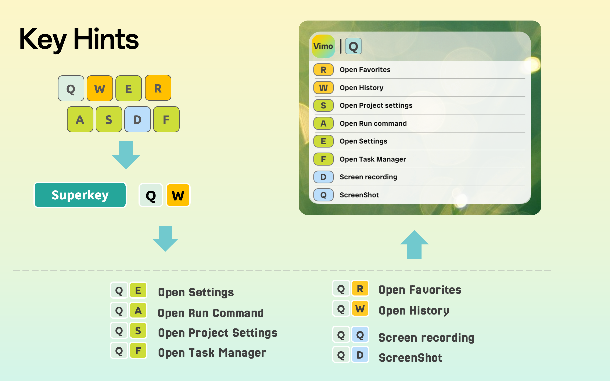

<!--
Canonical source: README.md
Locale: ko
Do not edit product facts independently from the English canonical README.
-->

  

<h1 align="center">Vimo Rebinder</h1>

  <strong>모든 앱이 당신의 단축키 습관을 따르도록 하세요.</strong>

  Windows와 macOS를 위한, 노코드 기반의 앱별 키보드 워크플로 관리자입니다.

  
  
  

  <a href="https://github.com/ChenghaoQ/Vimo-Rebinder/releases/latest"><strong>Windows 다운로드</strong></a>
  ·
  <a href="https://apps.microsoft.com/store/detail/9NVCW6P19QL7">Microsoft Store</a>
  ·
  <a href="https://apps.apple.com/us/app/vimo-rebinder/id6472165219?mt=12">Mac App Store</a>
  ·
  <a href="https://app.vimorebinder.com">공식 웹사이트</a>
  ·
  <a href="https://github.com/ChenghaoQ/Vimo-Rebinder/releases">Releases</a>

  <a href="README.md">English</a> ·
  <a href="README_zh.md">简体中文</a> ·
  <a href="README_ja.md">日本語</a> ·
  <strong>한국어</strong> ·
  <a href="README_de.md">Deutsch</a> ·
  <a href="README_fr.md">Français</a> ·
  <a href="README_es.md">Español</a> ·
  <a href="README_pt-BR.md">Português</a> ·
  <a href="README_ru.md">Русский</a>

  
   
  <em>하나의 단축키 구조를 현재 활성 앱에 맞게 자동으로 적용합니다.</em>

## 앱마다 단축키의 언어는 다릅니다.

브라우저 탭, 편집기, 오피스 도구, 디자인 도구, 시스템 동작은 모두 저마다 다른 단축키 규칙을 사용합니다. 같은 의도라도 앱이 달라지면 다른 키 조합이 필요하고, 그만큼 기억 부담, 손 이동 부담, 맥락 전환 비용이 쌓입니다.

Vimo Rebinder는 이렇게 흩어진 단축키를 구조화된 워크플로로 묶어 줍니다. 새로운 키 조합을 더 외우게 하는 대신, 일관된 명령 계층을 유지하면서 현재 사용 중인 앱에 맞는 단축키를 보냅니다.

Vimo는 단축키를 늘리는 것이 아니라, 사용하는 비용을 줄입니다.

## Before / After

| Vimo 없음 | Vimo 사용 |
| --- | --- |
| 앱마다 다른 단축키 | 하나로 이어지는 개인 워크플로 |
| 쓰기 불편한 여러 키 조합 | 기억하기 쉬운 구조화된 키 시퀀스 |
| 흩어진 키 조합을 따로 외움 | 기능별 그룹과 공간 배치 |
| 스크립트를 작성하고 유지 | 시각적인 노코드 설정 |
| 매번 처음부터 다시 구성 | 프리셋과 재사용 가능한 앱 프로필 |

## 단순한 키 리매퍼가 아닙니다

기존 키 리매퍼는 어떤 키가 무엇을 입력하는지 바꿉니다. 자동화와 스크립트 도구는 컴퓨터가 할 수 있는 일을 넓혀 주지만, 보통은 설정과 유지 관리 부담도 함께 커집니다.

Vimo가 다루는 층은 다릅니다. 단축키를 사용할 때 드는 기억 부담, 이동 부담, 충돌, 맥락 전환 비용을 줄입니다. AutoHotkey, PowerToys, Karabiner-Elements 같은 도구와 일부 겹치는 경우도 있지만, 완전한 대체가 아니라 보완을 목표로 합니다.

## Vimo 사용 보기

| 워크플로 | 예시 |
| --- | --- |
| 브라우저와 편집기 탭 | 전환, 닫기, 다시 열기, 이동을 익숙한 하나의 구조에 담습니다. |
| 창과 데스크톱 제어 | 창 동작, 데스크톱 이동, 반복 동작을 손이 이미 익힌 위치에 둡니다. |
| 앱별 작업 | 각 앱에 별도 단축키를 주면서도 같은 Vimo 명령 습관을 유지합니다. |

## 코어 시스템

| 기능 | 실제 의미 |
| --- | --- |
| 앱별 프로필 | 같은 개인 워크플로를 여러 앱에서 재사용하고, Vimo가 현재 앱에 맞는 단축키를 보냅니다. |
| Super Key | 선택한 키를 누르거나 탭해 Vimo의 명령 계층에 들어가고, 놓으면 일반 입력으로 돌아갑니다. |
| 기능 그룹 | 창, 탭, 데스크톱, 편집, 탐색 같은 관련 작업을 함께 묶습니다. |
| 공간 키 존 | 창 동작은 W 주변에, 데스크톱 동작은 D 주변에 두고, 관련 명령은 그룹 키 가까이에 배치합니다. |
| 시각적 단축키 힌트 | 모든 단축키를 외우지 않아도 다음에 가능한 동작을 바로 볼 수 있습니다. |
| 프리셋과 인사이트 | 준비된 레이아웃으로 시작하고, 일정 기간의 단축키 사용 패턴도 확인할 수 있습니다. |

  

  

  

## 3단계로 시작

1. Vimo Rebinder를 설치합니다.
2. 전역 워크플로를 선택하거나 앱을 고릅니다.
3. 자연스럽게 느껴지는 단축키 구조에 동작을 할당합니다.

레이아웃을 익히는 동안에는 떠 있는 힌트를 보면 충분합니다. 스크립트는 필요 없고, 모든 단축키는 언제든 조정하거나 제거할 수 있습니다.

## Free 와 Pro

| 기능 | Free | Pro |
| --- | --- | --- |
| 무제한 전역 단축키 | ✓ | ✓ |
| 탭 화살표 탐색 | ✓ | ✓ |
| 시스템 단축키 프리셋 | ✓ | ✓ |
| 앱별 프로필 | — | ✓ |
| 전체 프리셋 라이브러리 | — | ✓ |
| 앱 간 단축키 이동 또는 복제 | — | ✓ |
| 최대 3대 기기 사용 | — | ✓ |

현재 요금제와 가격은 [pricing page](https://app.vimorebinder.com/pricing/)에서 확인하세요.

## 다운로드

| 플랫폼 | 진입점 | 비고 |
| --- | --- | --- |
| Windows 10 / 11 | [Latest GitHub Release](https://github.com/ChenghaoQ/Vimo-Rebinder/releases/latest) | Windows 설치 파일은 GitHub Releases로 배포됩니다. |
| Windows 10 / 11 | [Microsoft Store](https://apps.microsoft.com/store/detail/9NVCW6P19QL7) | 스토어 기반 설치, 업데이트, 구매 기록 관리가 가능합니다. |
| macOS 13.0+ | [Mac App Store](https://apps.apple.com/us/app/vimo-rebinder/id6472165219?mt=12) | macOS는 App Store로 배포되며 GitHub Release 자산이 아닙니다. |

## Windows 설치와 개인정보

직접 배포되는 Windows 설치 파일은 공식 [Vimo Rebinder GitHub Releases](https://github.com/ChenghaoQ/Vimo-Rebinder/releases/latest)에서 받을 수 있습니다.

이 설치 파일은 Vimo의 자체 서명 게시자 인증서를 사용합니다. Windows는 최초 설치 전에 인증서 가져오기를 요청할 수 있습니다. Microsoft Store 버전은 이 수동 절차가 필요하지 않습니다.

단축키 설정은 로컬에 저장됩니다. Vimo는 워크플로 기능이 활성화되어 있을 때만 키보드 단축키와 현재 활성 앱을 관찰합니다.

기술적인 세부 내용은 [Privacy Policy](https://app.vimorebinder.com/docs/privacy-policy/), [Windows Installation Guide](docs/windows-installation.md), [Privacy and Data Notes](docs/privacy-and-data.md)를 참고하세요.

## 플랫폼과 언어

- Windows 10 및 Windows 11
- Windows 설치 파일: x64
- macOS 13 이상
- English, 简体中文, 日本語, 한국어, Français, Deutsch, Español, Português, Русский

## FAQ

### Vimo Rebinder는 키 리매퍼인가요?

단축키 워크플로를 다시 연결할 수는 있지만, 핵심 목적은 그보다 넓습니다. 앱별 단축키 구조, 시각적 힌트, 프리셋, 일관된 명령 계층이 중심입니다.

### AutoHotkey, PowerToys, Karabiner-Elements, 스크립트 도구를 대체하나요?

아니요. 이런 도구들은 많은 자동화와 리매핑 작업에 매우 유용합니다. Vimo는 노코드 단축키 워크플로 관리에 집중하며, 역할이 겹치지 않는 범위에서는 함께 사용할 수 있습니다.

### GitHub에서 macOS 다운로드도 제공하나요?

아니요. GitHub Release 자산은 Windows 설치 파일만 제공합니다. macOS 사용자는 [Mac App Store](https://apps.apple.com/us/app/vimo-rebinder/id6472165219?mt=12)를 이용하세요.

### 공식 Vimo 구매와 Microsoft Store 구매는 서로 호환되나요?

아니요. 제품 기능은 동일하지만, 구매 기록과 라이선스 복원 경로는 별도로 관리됩니다.

### 왜 Vimo는 키보드 접근이 필요한가요?

Super Key, 앱별 워크플로, 떠 있는 힌트, 재할당된 단축키 실행은 키보드 이벤트 처리에 의존합니다. 원하지 않을 때는 Vimo를 비활성화하세요.

## 지원

- [GitHub Issues](https://github.com/ChenghaoQ/Vimo-Rebinder/issues): 버그, 설치 문제, 재현 가능한 제품 이슈를 제보하는 곳입니다.
- [GitHub Releases](https://github.com/ChenghaoQ/Vimo-Rebinder/releases): Windows 배포 자산과 릴리스 기록을 확인할 수 있습니다.
- [Official Website](https://app.vimorebinder.com): 제품 페이지, 가격, 정책 링크를 제공합니다.
- Email: [vimo_rebinder@outlook.com](mailto:vimo_rebinder@outlook.com)

## 독점 소프트웨어

Vimo Rebinder는 독점 소프트웨어입니다. 이 저장소는 Vimo Rebinder의 공개 제품 및 배포 진입점이지만, 오픈 소스 라이선스 부여를 의미하지 않습니다.
